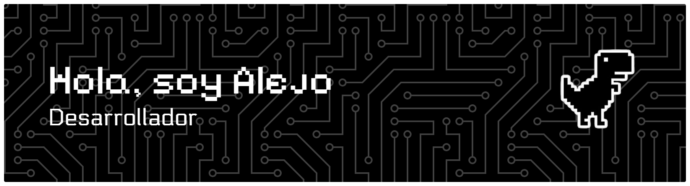
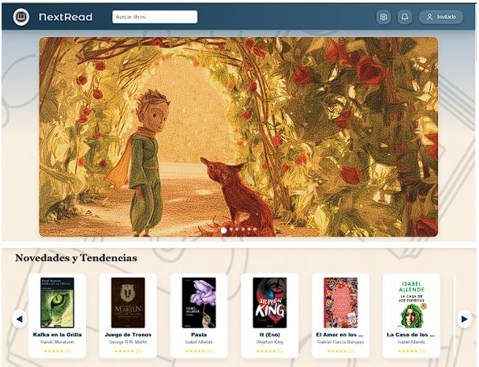
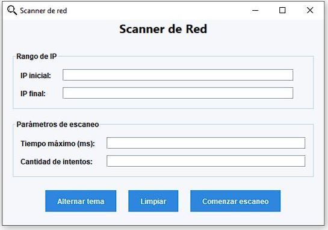
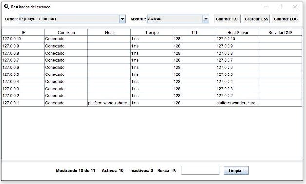

## Sobre mí
- Actualmente trabajando en:  
  <a href="https://github.com/Santino7537/Acisum">Acisum</a>

- Tecnologías principales: Java, JavaScript, Python

- Contacto:  
  guerra.alejoet36@gmail.com

---

## Tech Stack

<table>
<tr>
<td valign="top" width="50%">

### Lenguajes

### Backend

### Base de datos

</td>

<td valign="top" width="50%">

### Frontend

### Herramientas

### Otros

</td>
</tr>
</table>

---

## Estadísticas

<table>
<tr>
<td width="50%">

</td>

<td width="50%">

</td>
</tr>
</table>

---

## Actividad

---

## Proyectos Destacados

- **NextRead** (en desarrollo)  
  Aplicación para mejorar la experiencia de lectura.

  

    
    
  

- **IPVision**  
  Herramienta de análisis de redes: escaneo de IPs, monitoreo y procesamiento de datos.

  

    
    
  

---

## Objetivo
Seguir creciendo en backend, redes y diseño de software, aplicando buenas prácticas y tecnologías modernas, mientras aporto valor en proyectos reales.

---
